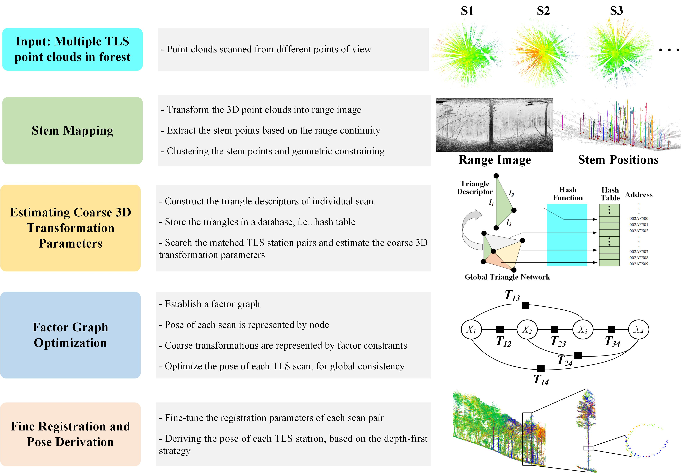
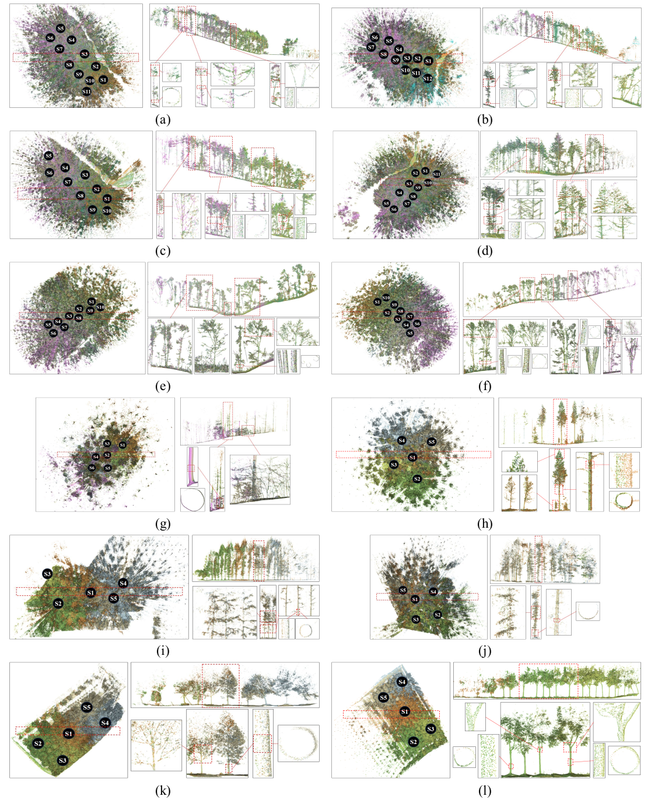

[](README.md) [](README.zh.md)

# :deciduous_tree: HashReg
Automated TLS Multi-Scan Registration in Forest Environments: An end-to-end solution based on Hash Table

## :bulb: Introduction
Terrestrial laser scanning (TLS) has proven to be an effective tool for forest inventories due to its accurate, non-destructive capability to document 3D space structures. The multi-scan mode of TLS enables comprehensive data acquisition, but the point cloud of each scan must be aligned into a unified coordinate. In practice, the most common solution involves manually placing artificial markers in the field, which is time-consuming and labor-intensive. Consequently, the automated multi-scan registration method is highly appreciated for subsequent applications. This study presents an automated TLS multi-scan registration algorithm for forest point clouds, HashReg, utilizing the high-efficiency operations of Hash Table.



## :bulb: Demo
The point clouds from multiple scans are represented in different colors and transformed into common coordinate, with the scan positions are represented by a series of black circles.

To better visualize the internal details of each plot, the area marked with the red dashed box is extracted for a cross-section view, displayed in the top-right part of the subfigure. Further, some trees are randomly selected and zoomed in to reveal the registration result. The close-up views of the stem, branch and even structure of the canopy are provided in the bottom-right part of each subfigure.





***
:point_right::point_right::point_right: : **If you are interested to tested them with HashReg, here is a manual for quick start.**

## Quick Start Mannual
### :package: Dependency
The code have been tested on Ubuntu 18.04. The third-party library are listed as follows:

> PCL >=1.10 (use 1.12 in this project)

> libLAS (1.8.1)

> Eigen >=3.3.4

> OpenCV >=3.3.1

> CSF (Cloth Simulation Filter)

> small_gicp

> GTSAM

> OpenMP

### Install PCL Library (1.12 in this project)

To install a newer version in Ubuntu 18.04, you can download and compile PCL through the source code:
[https://github.com/PointCloudLibrary/pcl](https://github.com/PointCloudLibrary/pcl).

**Note: Install PCL 1.12 in different path with PCL 1.8(System), to avoid version confiliction.**
 

#### Install liblas Library

Visit [Download](https://liblas.org/download.html#download) or [GitHub Repository](https://github.com/libLAS/libLAS) to get the source code of libLAS.

``` bash
cd liblas or your souce-code-path
mkdir makefiles
cd makefiles
```
Configure the basic core library for the “Unix Makefiles” target:

``` bash
cmake -G "Unix Makefiles" ../
-- The C compiler identification is GNU
-- The CXX compiler identification is GNU
-- Checking whether C compiler has -isysroot
-- Checking whether C compiler has -isysroot - yes
-- Check for working C compiler: /usr/bin/gcc
-- Check for working C compiler: /usr/bin/gcc -- works
-- Detecting C compiler ABI info
-- Detecting C compiler ABI info - done
-- Checking whether CXX compiler has -isysroot
-- Checking whether CXX compiler has -isysroot - yes
-- Check for working CXX compiler: /usr/bin/c++
-- Check for working CXX compiler: /usr/bin/c++ -- works
-- Detecting CXX compiler ABI info
-- Detecting CXX compiler ABI info - done
-- Enable libLAS utilities to build - done
-- Configuring done
-- Generating done
-- Build files have been written to: /Users/hobu/hg/liblas-cmake/makefiles
```

Compile this code and install.

``` bash
make
sudo make install
```

Finally, test by run lasinfo.
``` bash
lasinfo Path_To_Your_Data/XXX.las
```

In your terminal, you should see the output like this.

``` bash
---------------------------------------------------------
  Header Summary
---------------------------------------------------------

  Version:                     1.2
  Source ID:                   0
  Reserved:                    0
  Project ID/GUID:             '00000000-0000-0000-0000-000000000000'
  System ID:                   'libLAS'
  Generating Software:         'libLAS 1.8.1'
  File Creation Day/Year:      230/2024
  Header Byte Size             227
  Data Offset:                 227
  Header Padding:              0
  Number Var. Length Records:  None
  Point Data Format:           3
  Number of Point Records:     21433359
  Compressed:                  False
  Number of Points by Return:  0 0 0 0 0 
  ```

#### Install the Eigen Library
You can install the eigen library through apt way.

``` bash
sudo apt update
sudo apt-get install libeigen3-dev
```
Or you can just download and extract Eigen's source code:
[https://eigen.tuxfamily.org/index.php?title=Main_Page](https://eigen.tuxfamily.org/index.php?title=Main_Page)

#### Install OpenCV 3.3.1
You can install the OpenCV library through apt way.

``` bash
sudo apt update
sudo apt install libopencv-dev python3-opencv
# check opencv version 
pkg-config --modversion opencv
```

#### Install CSF (Cloth Simulation Filter)
 
CSF (Cloth Simulation Filter) is an algorithm for LiDAR ground filtering. It usually employed to the Airborne Lidar data, but also shown good performance on the Terrastrial-, Mobile-, and even Spaceborne- Lidar.

You can follow the instruction of [CSF](https://github.com/jianboqi/CSF).

``` bash
mkdir build #or other name
cd build
cmake ..
make
sudo make install
```
**Related papers:**
W. Zhang, J. Qi*, P. Wan, H. Wang, D. Xie, X. Wang, and G. Yan, [“An Easy-to-Use Airborne LiDAR Data Filtering Method Based on Cloth Simulation,”](http://www.mdpi.com/2072-4292/8/6/501/htm) Remote Sens., vol. 8, no. 6, p. 501, 2016.

#### Install small_gicp
small_gicp is a header-only C++ library providing efficient and parallelized algorithms for fine point cloud registration (ICP, Point-to-Plane ICP, GICP, VGICP, etc.). The C++ version of small_gicp can be installed by following commands.

``` bash
sudo apt-get install libeigen3-dev libomp-dev

cd small_gicp
mkdir build && cd build
cmake .. -DCMAKE_BUILD_TYPE=Release && make -j
sudo make install
```

In this program, small_gicp is employed to re-fine registration.

### :gear: Build HashReg
Clone this repository, then compile.

``` bash
git clone https://github.com/xchwang1998/Forest_TLS_Reg.git
cd ./Forest_TLS_Reg
mkdir build && cd build
cmake ..
make
```

### :runner: Launch HashReg

There are several node for different missions in this project, such as:

- Registrates two TLS stations 
``` bash
./Reg2TLSPoints [Target Station's File Name] [Source Station's File Name]
```
**Note: You should first `mkdir your_data_folder` and revise the corresponding path in source code.**

- Registrates multiple TLS stations

Place your data in corresponding path, then run `MultiRegTLSPoints`.
``` bash
./MultiRegTLSPoints
```
- Registrates multiple TLS stations in FGI forest datasets, Tongji Trees, and ETH trees.

``` bash
# run MultiRegFGI, and input the number of TLS stations
./MultiRegFGI [NUM of Stations]
# run MultiRegTongji, and input Plot-ID
./MultiRegTongji [Plot NUM, 1-4]
# run MultiRegETH, and input the number of TLS stations
./MultiRegETH [NUM of Stations]
```

## :pencil: Citation
If you use this repository, please cite our paper.

## :mailbox: Contact Information
If you have any questions, please do not hesitate to contact me: xchwang@whu.edu.cn
